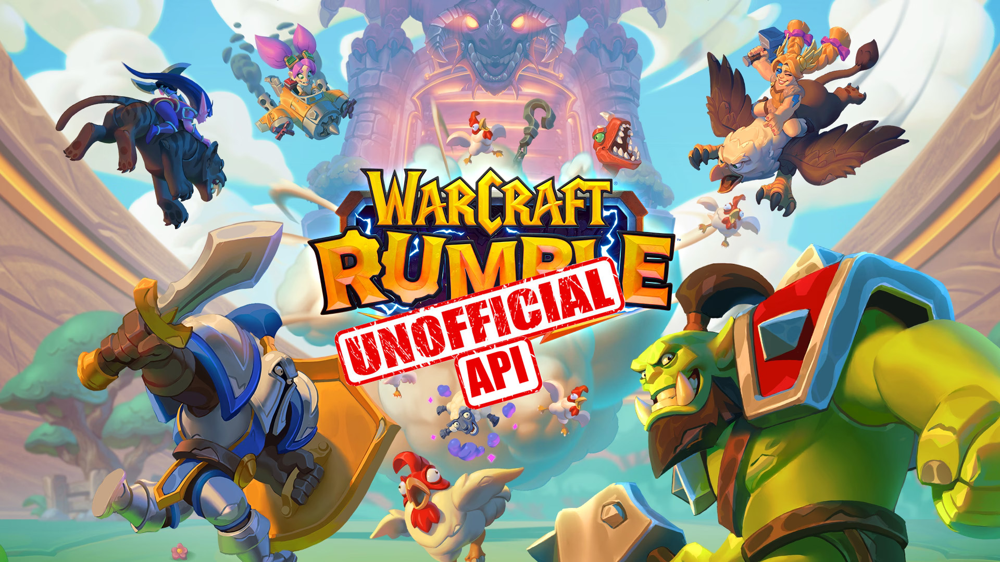

<h1 align="center">Unofficial Warcraft Rumble RESTful API</h1>



This is the unofficial Warcraft Rumble RESTful API. This project aims to deliver the basics of [Warcraft Rumble](https://warcraftrumble.blizzard.com) until [Blizzard](https://www.blizzard.com) releases their own.

All objects are returned as a JSON.

You can access the FastAPI Docs at: **SOON**. (Docker works fine locally, testing DNS name)


--- 


## Units

Every unit has the following attributes and data types: 

| Field  | Type |
|---|---|
| id | int |
| cost | int |
| name | string |
| faction | string |
| type | string |
| description | string |
| traits | string array |

A unit is represented as: 

```json
{
  "id": 1,
  "cost": 6,
  "name": "Abomination",
  "faction": "Undead",
  "type": "Troop",
  "description": "This Tanky mass of flesh and steel will Hook ranged enemies, drawing them into his Cleave attack.",
  "trait": [
      "Tank",
      "Hook",
      "Melee",
      "AoE"
  ]
}
```

---

# Units Endpoints

All of the following endpoints live under `/units/`

## **/units/**

Retrieves a JSON file containing information about all available units.

## **/units/{id}**

Retrieves a JSON file containing information about the specified unit.

` id options: 1 - 68 `

## /units/faction/{unit_faction}

Retrieves a JSON file containing information about all units belonging to the specified faction.

**Unit faction options:**
- Alliance
- Beast
- Blackrock
- Horde
- Undead

## /units/type/{unit_type}

Retrieves a JSON file containing information about all units of the specified type.

**Unit type options:**
- Leader
- Spell
- Troop

## /units/cost/{unit_cost}

` unit_cost options: 1 - 6 `

Retrieves a JSON file containing information about all units with the specified cost.

## **/units/traits/{unit_trait}**

Retrieves a JSON file containing information about all units with the specified trait.

**Unit trait options:**
- Ambush
- Armored
- Attack Root
- Attack Stun
- Bloodlust
- Bombard
- Cannibalize
- Carrion
- Charge
- Cheap Shot
- Cycle
- Dismounts
- Elemental
- Fury
- Hatching
- Haunt
- Heal Squadmate
- Healer
- Hook
- Longshot
- Miner
- Percent Damage
- Poisonous
- Possession
- Rebirth
- Resistant
- Revive
- Siege Damage
- Stealth
- Summoner
- Tank
- Unbound
- Vulnerable

Additionally, you can include up to three additional "subtraits" for a more detailed query to retrieve all units possessing these traits.

You must use the following structure: ` /units/traits/{unit_trait}?s1={subtrait1}&s2={subtrait2}&s3={subtrait3} `


Example:  ` /units/traits/Tank?s1=Melee&s2=Fast&s3=Elemental `

Will return: 

``` json
{
"id": 5,
"cost": 4,
"name": "Baron Rivendare",
"faction": "Undead",
"type": "Leader",
"description": "Bane of the Scarlet Crusade.",
"traits": [
      "Tank",
      "Armored",
      "Elemental",
      "Fast",
      "Melee",
      "One-Target"
  ]
}
```

# Future Updates and Feedback

This RESTful API is very likely to be updated in the future.

If you have any suggestion, feel free to contact me.

# Disclaimer

This RESTful API **is not** affiliated with or endorsed by Activision Blizzard, Inc.
